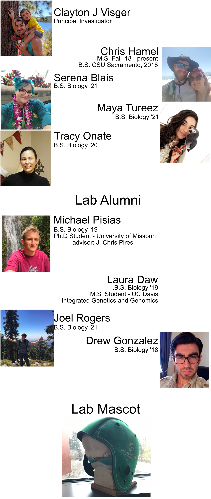
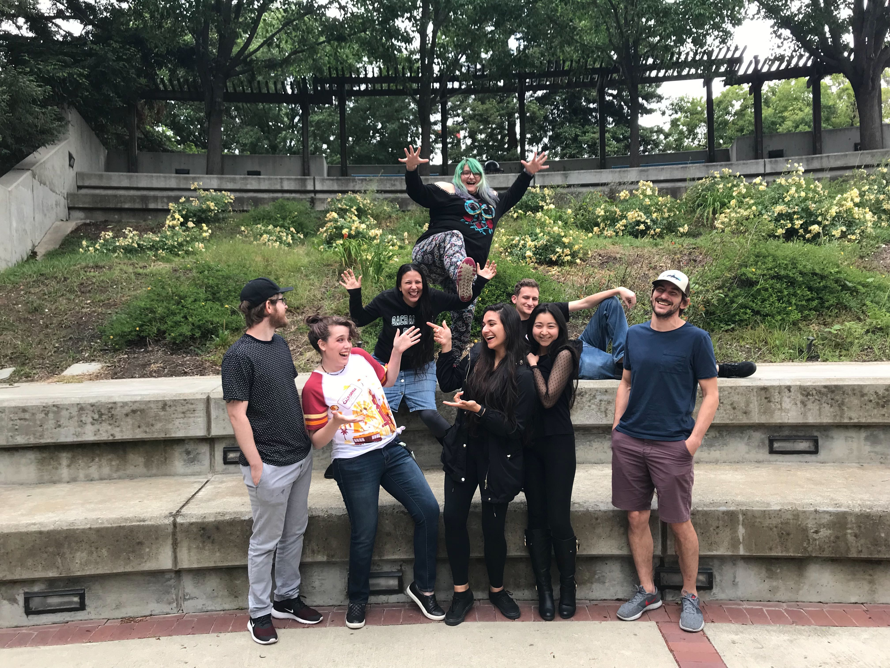

# Interested in joining?
The Visger lab is always looking for self-motivated undergraduate and graduate students.  While the current focus of our lab is on whole-genome duplication, students may pursue any question driven project that incorporate either genomics, transcriptomics, ecological modeling, or cytology. If that sounds like you, please contact Clayton Visger.

## Collaborators
[The Sessa Lab](https://sessalab.biology.ufl.edu/)

[The Watkins Lab](https://eddiewatkins.com/)
